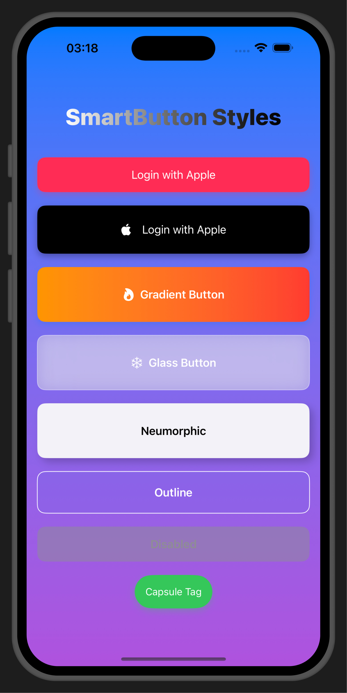
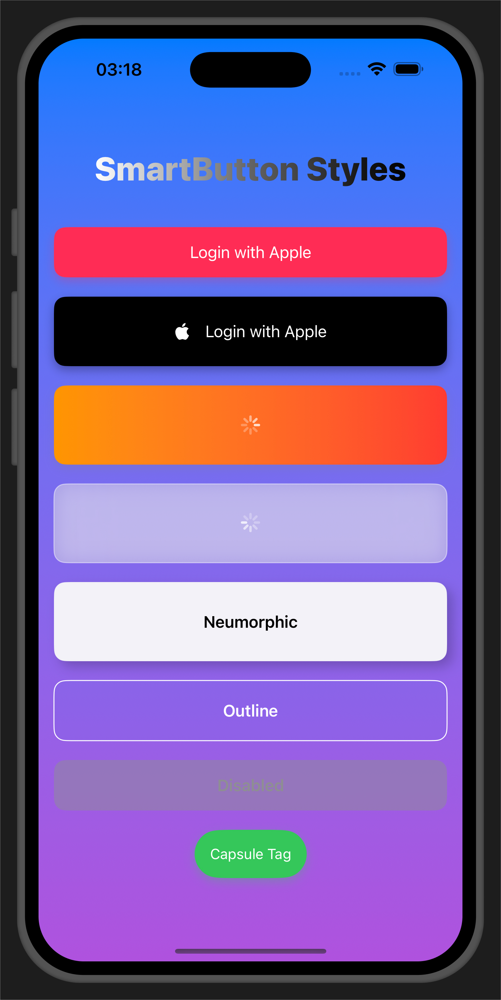

# 📦 SmartButton for SwiftUI

SmartButton is a fully customizable, production-ready SwiftUI button component that adapts to every UI need. From gradient and neumorphic to glassmorphic styles, it's packed with flexible features for modern iOS apps.

---

## 🚀 Features

- **Sync & async support**
- **Loading state** with spinner
- **Optional icons** using SF Symbols
- **Gradient, glass, neumorphic & outline styles**
- **Light/dark mode compatibility**
- **Full-width or adaptive-width layouts**
- **Capsule or rounded corners**
- **Custom height, colors, font, and shadow**
- **Disabled state styling**

---

## 💻 Usage Examples

### 🔹 Solid Button (default)
```swift
SmartButton(
    title: "Submit",
    action: { print("Tapped!") }
)
```

### 🌈 Gradient Button
```swift
SmartButton(
    title: "Pay",
    style: .gradient(
        LinearGradient(colors: [.blue, .purple], startPoint: .top, endPoint: .bottom)
    ),
    asyncAction: {
        try? await Task.sleep(nanoseconds: 2_000_000_000)
    }
)
```

### ❄️ Glassmorphic Button
```swift
SmartButton(
    title: "Frosted",
    iconName: "snowflake",
    style: .glass(backgroundOpacity: 0.3, strokeColor: .white.opacity(0.5)),
    asyncAction: { /* your async work */ }
)
```

### 🌕 Neumorphic Button
```swift
SmartButton(
    title: "Depth",
    style: .neumorphic(),
    backgroundColor: Color(.systemGray6),
    foregroundColor: .primary
)
```

### 🎯 Capsule Adaptive Button
```swift
SmartButton(
    title: "Tag",
    fullWidth: false,
    adaptiveWidth: true,
    cornerStyle: .capsule,
    style: .solid,
    action: { print("Tapped capsule!") }
)
```

---

## 🔧 Parameters

| Property           | Type                 | Description                                |
|--------------------|----------------------|--------------------------------------------|
| `title`            | `String`             | Text shown in the button                   |
| `action`           | `(() -> Void)?`      | Action to perform on tap                   |
| `asyncAction`      | `(() async -> Void)?`| Async action with loading state            |
| `style`            | `ButtonStyleType`    | `.solid`, `.gradient`, `.glass`, etc.      |
| `backgroundColor`  | `Color`              | Base color or fallback                     |
| `foregroundColor`  | `Color`              | Text/icon color                            |
| `font`             | `Font`               | Button label font                          |
| `height`           | `CGFloat?`           | Optional fixed height                      |
| `iconName`         | `String?`            | SF Symbol icon                             |
| `iconSize`         | `CGFloat`            | Icon font size                             |
| `iconSpacing`      | `CGFloat`            | Space between icon and text                |
| `fullWidth`        | `Bool`               | Expand to max width                        |
| `adaptiveWidth`    | `Bool`               | Resize based on content                    |
| `cornerStyle`      | `CornerStyle`        | `.capsule` or `.rounded(CGFloat)`          |
| `isDisabled`       | `Bool`               | Greyed out and non-tappable state          |

---

## 📱 Requirements

- iOS 15.0+
- Swift 5.8+

---

## 📦 Installation

### Option 1: Drag & Drop
Copy `SmartButton.swift` into your project.

### Option 2: Swift Package Manager 
You can install **SmartButton** in your project using **Swift Package Manager**, which is built into Xcode.

### 🔹 Option 1: Add via Xcode UI

1. Open your Xcode project
2. Go to **File > Add Packages...**
3. In the search bar, enter:

```
https://github.com/liimmaa/SmartButton
```

4. Select the version (use `1.0.0` or “Up to Next Major”)
5. Click **Add Package**
6. Import it into your Swift file:

```swift
import SmartButton
```

---

### 🔹 Option 2: Add via `Package.swift`

```swift
dependencies: [
    .package(url: "https://github.com/liimmaa/SmartButton", from: "1.0.0")
]
```

Then import where needed:

```swift
import SmartButton
```

---

## 📸 Screenshots




---

## 🪪 License
MIT License. Free to use and customize in personal or commercial apps.

---

Built with ❤️ for SwiftUI.
